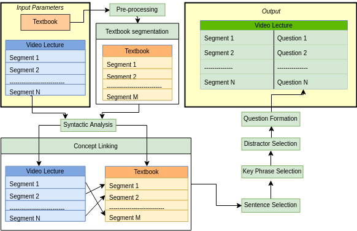

# ICS Videos
This project is part of my thesis work. 
The primary goal of this system is to make video lectures more interactive by inserting automatically generated assessment items between video segments. 
The developed system takes a segmented video lecture and a textbook document on the related subject as input parameters. Then, the system generates the gap-fill questions from it in five stages: textbook segmentation, concept linking, sentence selection, key selection, and distractor selection.
The system overview:

# Abstract

Video lectures are great learning resources that provide students with the ability to revisit class material and prepare for the exams. Professors record most classroom video lectures; therefore, it can be difficult for students to remain focused for the duration of the lecture video and easy to skip essential parts. Providing assessment items during the video can help to keep students engaged. However, manually generating questions is an expensive and time-consuming task. This thesis proposes an automatic question generation system that can generate gap-fill questions related to the video by using the content of the course textbook. Gap-fill questions are fill-in-the-blank questions with multiple choices (one correct answer and several distractors) provided. The system we developed has five stages. 
First, the system creates textbook-video segment pairs based on the semantic similarity score. Next, the system finds the most informative and relevant sentence from the textbook segment and the most appropriate keys from it. The keys are noun phrases, which will serve as an answer to the question. Finally, the system generates gap-fill questions by first blanking out keys from the sentence and then determining the distractors for these keys. For the performance evaluation, we asked students, currently enrolled in a course, to evaluate questions created by our system. 
Analysis of the evaluation results showed that our system successfully generates good questions, which are testing the knowledge of the course. However, the system failed to generate meaningful and relevant distractors for the questions. Hence, our system needs significant improvements in the distractors selection stage. As the future directions, we propose combining the concept embeddings with information retrieval approaches for distractors selection and the graph-based ranking model for the sentence and key phrase selection.

### Authors
* **Maksim Egorov** - [Maxikfu](https://github.com/Maxikfu)

#### Resources

**Automatic Gap-fill Question Generation from Text Books**
(http://www.aclweb.org/anthology/W11-1407)

